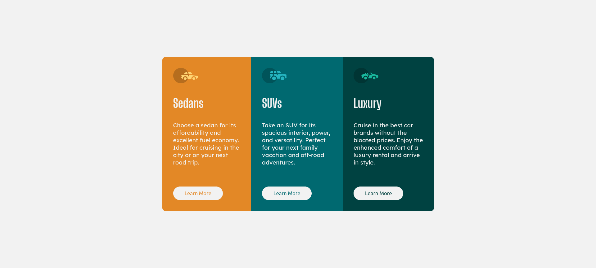
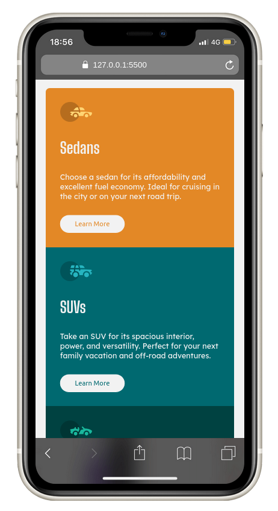

# Frontend Mentor - 3-column preview card component solution

This is a solution to the [3-column preview card component challenge on Frontend Mentor](https://www.frontendmentor.io/challenges/3column-preview-card-component-pH92eAR2-). Frontend Mentor challenges help you improve your coding skills by building realistic projects. 

## Table of contents

- [Overview](#overview)
  - [Screenshot](#screenshot)
  - [Links](#links)
- [My process](#my-process)
  - [Built with](#built-with)
- [Author](#author)

## Overview

### Screenshot

### Links

- [Solution URL](https://github.com/lutfiismail52/3-column-preview-card-component/)
- [Live Site URL](https://lutfiismail52.github.io/3-column-preview-card-component/)

## My process

### Built with

- Semantic HTML5 markup
- CSS custom properties
- Mobile-first workflow

## Author

- Frontend Mentor - [@lutfiismail52](https://www.frontendmentor.io/profile/lutfiismail52)
- YouTube - [@kodedusk](https://www.youtube.com/@kodedusk)
- Instagram - [@lutfiismail47](https://www.instagram.com/lutfiismail47)
- Medium - [@lutfiismail47](https://medium.com/@lutfiismail47)